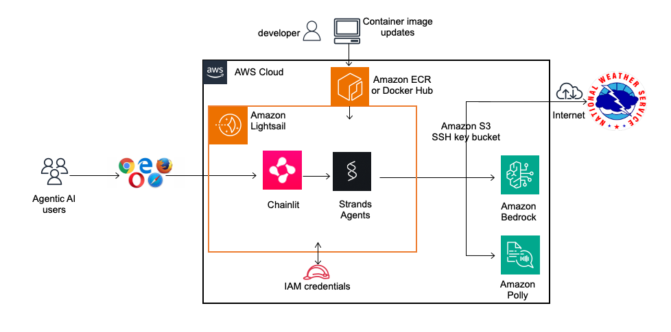
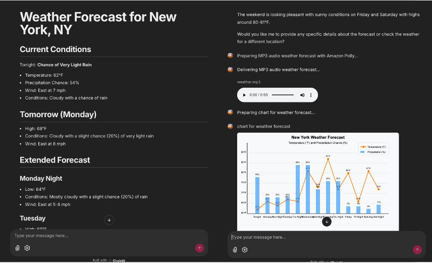
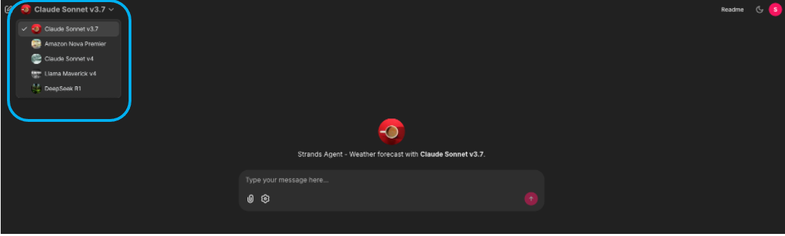
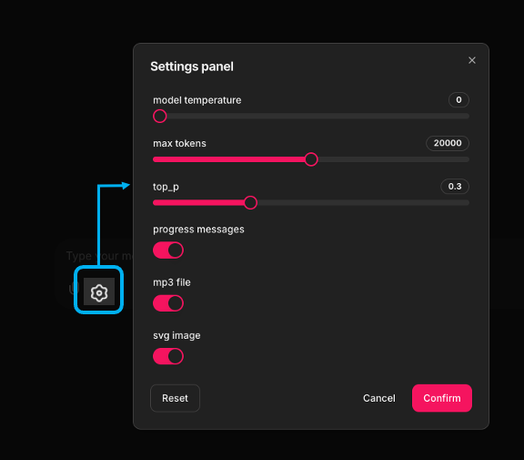

## Strands Serverless

[](https://opensource.org/licenses/MIT)
[](https://github.com/didier-durand/strands-serverless/actions/workflows/build_python.yaml)
[](https://github.com/didier-durand/strands-serverless/actions/workflows/build_docker.yaml)
[](https://hub.docker.com/r/didierdurand/strands-chainlit/)


1. [Presentation](#1-presentation)
2. [Architecture](#2-architecture)
3. [Screenshots](#3-screenshots)
4. [Usage](#4-usage)
5. [Backend execution log](#5-backend-execution-log)

## 1. Presentation



This repository `strands-serverless` focuses on serverless implementations of Strands Agents. It does so for the well-known 
benefits of the serverless architecture (cost-efficiency, productivity, etc.). Feel free to clone, fork and extend 
it for your own use. If you like it, a GitHub star will be much appreciated!

This first experiment is the composition of [Strands Agents](https://strandsagents.com/) with [Chainlit](https://docs.chainlit.io/get-started/overview)
(web-based interface) in one bundle. It delivers a complete AI agent in one Docker image running as an Amazon Lightsail  
virtual cloud server. 

Strands Agents is the agentic framework [released by Amazon Web Services on May 16th, 2025](https://aws.amazon.com/blogs/opensource/introducing-strands-agents-an-open-source-ai-agents-sdk/):
"*The open source Strands Agents project takes a model-driven approach to building and running AI agents in just a 
few lines of code. Strands Agents scales from simple to complex agent use cases, and from local development to deployment in 
production. Multiple teams at AWS already use Strands for their AI agents in production, including Amazon Q Developer, 
AWS Glue, and VPC Reachability Analyzer.*"

The agentic loop of Strands Agents classically works as follows (source: [AWS blog](https://aws.amazon.com/blogs/opensource/introducing-strands-agents-an-open-source-ai-agents-sdk/)):


The bundling of Strands Agents ([Python SDK](https://github.com/strands-agents/sdk-python) and [associated tools](https://github.com/strands-agents/tools)) 
(remote http requests, sound generation, etc.) with Chainlit (open-source Python package to rapidly build browser-based production-ready conversational UI 
for AI agents) delivers a feature-complete autonomous agent with a friendly graphical UI and multimodal capabilities (sound player, image and video 
viewer, etc.) in a single container image.

We also provide a complete [AWS CloudFormation (CFN)](https://aws.amazon.com/cloudformation/) template, AWS solution for 
[Infrastructure-as-Code](https://en.wikipedia.org/wiki/Infrastructure_as_code), to allow an easy instantiation of all required resources. Key aspects of this template [cfn-strands-lightsail-chainlit.yaml](cfn/cfn-strands-lightsail-chainlit.yaml)
are detailed below. Finally, this repository is equipped with [workflows based on GitHub Actions](.github/workflows) to check Python code and run tests on it, build docker image with this code, validate the quality of CFN template

### 2. Architecture

Our implementation is an extension of the [Weather report example](https://strandsagents.com/0.1.x/examples/python/weather_forecaster/) 
provided in the documentation. It adds live reporting of agent progress in the Chainlit chat window, as well as MP3 sound file generation and SVG 
chart delivery. The components involved are pictured in the introductory chart.

The agentic part of our code is in [strands-weather.py](src/strands_chainlit/strands_weather.py):

```
weather_agent = Agent(
        system_prompt=WEATHER_SYSTEM_PROMPT,
        tools=[http_request, speak],
        model=BedrockModel(
            model_id=model_id,
        )
    )
    question = f"{message.content}"
    response = await get_response(agent=weather_agent, prompt=question, step=STEP_DURATION)
```

This code section creates a new agent instance on the fly for each request expressed by Chainlit's `message.content` and waits for the 
response that will be returned to requesting user. The function get_response() in [strands_utils.py](src/strands_utils.py) handles 
the stream of asynchronous events generated by the agent until the incrementally created response is complete. This function 
leverages the [Python AsyncIterator](https://superfastpython.com/asynchronous-generators-in-python/) pattern to capture and process the stream of all possible events - 
[full list in Strands Agents documentation](https://strandsagents.com/latest/user-guide/concepts/streaming/async-iterators/#event-types) - raised by the agent when 
it executes a task.  For example, as visible during execution, the handling of events allows to capture the tool calls and the LLM token consumption. This can be used for better 
self-management by the agent or for user information in the Chainlit UI. Our implementation optionally (via Chainlit's chat settings) reports the token consumption while a request is being processed. 

For various reasons (parallel processing, high throughput, resource efficiency), Strands Agents SDK is heavily based on 
asynchronous [Python programming](https://realpython.com/python-async-features/). This form of Python programming must be selected as on application side for 
high-performance code. It is more involved than the introductory [synchronous interface](https://strandsagents.com/latest/) also proposed by Strands Agents. But it can 
efficiently scale much further.

The multi-model integration of Strands Agents is seamless: it leverages the combined use of native support for various foundation models (Amazon Nova, 
Anthropic Claude, etc.) through AWS Bedrock with the chat profile supported by Chainlit. To achieve it, we allocate a different Chainlit chat profile to 
each model. The Chat Profile is then connected to the model selection for the agent creation: see `model=BedrockModel(model_id=model_id)` in code snippet 
above. So, by switching to another Chainlit chat profile, you switch to another LLM.

Also, this project demonstrates the autonomous use of additional tools by the agent as soon as they allowed at agent creation:

1. HTTP requests (with tool name `http_request`- see code excerpt above) to external sites (here the US National Weather service) 
to obtain the raw weather data for a given location before it get turned to a clean writing by the LLM.
2. Amazon Polly (with tool named `speak`) to synthesize an MP3 file delivering the weather predictions in a vocal form that can be listened to 
from the Chainlit interface.
3. the use of the LLM (when the model is able to do it: Anthropic Claude, Nova Premier, etc.) to generate an SVG diagram charting the predicted temperatures over the course of a day. 
This chart is also delivered as a file created by the Strands tool creating files.

This project also demonstrates the ability to configure via some LLM parameters like temperature or max_tokens through Chainlit Dialog Settings. See screenshot below.

### 3. Screenshots

The final result looks like:



For the corresponding backend messages, see section below.

The LLM selection is accessible via Chainlit's chat profile panel:



Chainlit's chat settings allow the configuration of various parameters that we chose for the LLM and agent.




### 4. Usage

* Fork, clone / download this repository
* Go to the console of your AWS account
Select SSM Parameter Store Service and define IAM credentials to be used by Strands Agents container (see section about CFN template below)
* Select the CloudFormation service
* Instantiate from the console, via "Create Stack", the CloudFormation template [cfn-strands-lightsail-chainlit-python.yaml](cfn/cfn-strands-lightsail-chainlit.yaml) 
included in this repository
* Wait until the stack creation is successfully completed
* Go to the AWS Lightsail service on the console and choose Containers in the menu  
* Click on your container instance and click on the hyperlink named "Public Domain" (located just below the instance header)
* The browser will open with Chainlit login screen.
* Authenticate with (username, password) - The default values are `strands-agents`and `pwd4strands`but you can update them by setting 
the environment variables `STRANDS_USERNAME`and `STRANDS_PASSWORD`in the CFN template.
* Start asking for weather predictions of your favorite city. You will obtain the weather report in three formats: text, mp3 and graphical chart: see example below.
* Backend logs emitted by agent (see below) are visible on Lighsail console.

### Cloudformation template

Thanks to Amazon Lightsail being a fully managed service, the CFN template is limited in size: `AWS::Lightsail::Container` is the key component. 
The `Parameters`section cleanly separates the key parameters of the container deployment:

* the Chainlit start parameters as a [FastAPI application](https://fastapi.tiangolo.com/). Those values are injected 
into the container as environment variables when it is started.
* the container image with its Docker registry and tag
* The size of the container instance (defining its cost) deployed by LightSail
* The AWS IAM credentials allowing Strands Agents to access other services like Bedrock or Polly. 

**Notes:** 
1. the usual best practice with Lambda, EC2, ECS, etc. is to use [execution roles](https://medium.com/aws-lambda-serverless-developer-guide-with-hands/aws-lambda-permissions-execution-role-and-resource-based-policies-be2e325998fc) 
is currently not possible with Lightsail. So, we have to use the usual pair of environment variables used by boto3 to provide access to services for Lighsail container. To avoid the bad practice of storing them in 
the template and committing them to git, we obtain those credentials from AWS SSM parameters where those values can be permanently stored across successive 
Lightsail deployments without ever being copied in the CFN template.
2. UnicitySuffix is a trick that we use in all our CFN templates: we concatenate it to all resource names to avoid name conflicts when we want 
to instantiate in parallel the same CFN template multiple times.
3. Amazon Lightsail delivers a pre-configured full-stack Linux server which automatically deploys an http(s) endpoint with an associated public DNS 
to reach the application.

### 5. Backend execution log

Strands Agents will report its activity on the backend via stdout / stderr messages. Here is an excerpt of such log messages:

```
[16/Jun/2025:07:14:31] auth callback: <>
[16/Jun/2025:07:14:31] authenticated user: strands-agents
[16/Jun/2025:07:14:52] 2025-06-16 07:14:52 - Found credentials in environment variables.
[16/Jun/2025:07:14:52] agent model: {'model_id': 'us.anthropic.claude-3-7-sonnet-20250219-v1:0', 'temperature': 0.0, 'max_tokens': 20000, 'top_p': 0.3}
[16/Jun/2025:07:14:54] I'd be happy to check the weather in Madison for you. Since there are multiple cities named Madison in the United States, I'll need to get the specific coordinates for Madison, Wisconsin (which is the largest and most well-known Madison).
[16/Jun/2025:07:14:55] Let me retrieve the current weather information for Madison, Wisconsin.
[16/Jun/2025:07:14:55] Tool #1: http_request
[16/Jun/2025:07:14:58] Now I'll get the detailed forecast using the forecast URL from the previous response:
[16/Jun/2025:07:14:58] Tool #2: http_request
[dd/Jun/2025:07:15:01] # Weather Forecast for Madison, Wisconsin
[dd/Jun/2025:07:15:01] ## Current Conditions (Overnight)
[dd/Jun/2025:07:15:01] - **Temperature:** 60°F
[dd/Jun/2025:07:15:02] - **Conditions:** Slight chance of showers and thunderstorms
[dd/Jun/2025:07:15:02] - **Wind:** Southeast at 5 mph
[dd/Jun/2025:07:15:02] - **Precipitation Chance:** 20%
[dd/Jun/2025:07:15:03] - **Details:** Mostly cloudy with a slight chance of showers and thunderstorms2025-06-16 07:15:03 - Translation file for en-GB not found. Using default translation en-US.
[dd/Jun/2025:07:15:03] before 5am.
[dd/Jun/2025:07:15:03] ## Today (Monday)
[dd/Jun/2025:07:15:03] - **High Temperature:** 85°F
[dd/Jun/2025:07:15:04] - **Conditions:** Partly sunny with a slight chance of rain showers and thunderstorms
[dd/Jun/2025:07:15:04] - **Wind:** South at 5 mph
[dd/Jun/2025:07:15:04] - **Precipitation Chance:** 20%
[dd/Jun/2025:07:15:05] - **Details:** A slight chance of rain showers between 8am and 1pm, then a slight chance of showers and thunderstorms. New rainfall amounts less than a tenth of an inch possible.
[dd/Jun/2025:07:15:05] ## Tonight (Monday Night)
[dd/Jun/2025:07:15:06] - **Low Temperature:** 65°F
[dd/Jun/2025:07:15:06] - **Conditions:** Mostly cloudy with a chance of showers and thunderstorms
[dd/Jun/2025:07:15:06] - **Wind:** South at 5 to 10 mph
[dd/Jun/2025:07:15:06] - **Precipitation Chance:** 30%
[dd/Jun/2025:07:15:07] - **Details:** A chance of showers and thunderstorms. New rainfall amounts between a quarter and half of an inch possible.
[dd/Jun/2025:07:15:07] ## Tomorrow (Tuesday)
[dd/Jun/2025:07:15:07] - **High Temperature:** 86°F
[dd/Jun/2025:07:15:07] - **Conditions:** Partly sunny with a chance of showers and thunderstorms
[dd/Jun/2025:07:15:08] - **Wind:** Southwest at 5 to 10 mph
[dd/Jun/2025:07:15:08] - **Precipitation Chance:** 50%
[dd/Jun/2025:07:15:08] - **Details:** New rainfall amounts between a half and three quarters of an inch possible.
[dd/Jun/2025:07:15:08] ## Extended Forecast
[dd/Jun/2025:07:15:09] - **Wednesday:** High of 79°F with showers and thunderstorms (80% chance)
[dd/Jun/2025:07:15:10] - **Thursday (Juneteenth):** High of 79°F with a slight chance of showers and thunderstorms (20% chance)
[dd/Jun/2025:07:15:10] - **Friday:** High of 83°F with a slight chance of rain showers (20% chance)
[dd/Jun/2025:07:15:11] - **Weekend:** Warming up with highs around 89°F on both Saturday and Sunday
[dd/Jun/2025:07:15:12] The weather pattern shows increasing chances of precipitation midweek with Wednesday being the wettest day, then clearing and warming for the weekend.{'role': 'assistant', 'content': [{'text': '# Weather Forecast for Madison, Wisconsin\n\n## Current Conditions (Overnight)\n- **Temperature:** 60°F\n- **Conditions:** Slight chance of showers and thunderstorms\n- **Wind:** Southeast at 5 mph\n- **Precipitation Chance:** 20%\n- **Details:** Mostly cloudy with a slight chance of showers and thunderstorms before 5am.\n\n## Today (Monday)\n- **High Temperature:** 85°F\n- **Conditions:** Partly sunny with a slight chance of rain showers and thunderstorms\n- **Wind:** South at 5 mph\n- **Precipitation Chance:** 20%\n- **Details:** A slight chance of rain showers between 8am and 1pm, then a slight chance of showers and thunderstorms. New rainfall amounts less than a tenth of an inch possible.\n\n## Tonight (Monday Night)\n- **Low Temperature:** 65°F\n- **Conditions:** Mostly cloudy with a chance of showers and thunderstorms\n- **Wind:** South at 5 to 10 mph\n- **Precipitation Chance:** 30%\n- **Details:** A chance of showers and thunderstorms. New rainfall amounts between a quarter and half of an inch possible.\n\n## Tomorrow (Tuesday)\n- **High Temperature:** 86°F\n- **Conditions:** Partly sunny with a chance of showers and thunderstorms\n- **Wind:** Southwest at 5 to 10 mph\n- **Precipitation Chance:** 50%\n- **Details:** New rainfall amounts between a half and three quarters of an inch possible.\n\n## Extended Forecast\n- **Wednesday:** High of 79°F with showers and thunderstorms (80% chance)\n- **Thursday (Juneteenth):** High of 79°F with a slight chance of showers and thunderstorms (20% chance)\n- **Friday:** High of 83°F with a slight chance of rain showers (20% chance)\n- **Weekend:** Warming up with highs around 89°F on both Saturday and Sunday\n\nThe weather pattern shows increasing chances of precipitation midweek with Wednesday being the wettest day, then clearing and warming for the weekend.'}]}
[dd/Jun/2025:07:15:15] I'll generate an MP3 sound file with the weather forecast for Madison, Wisconsin. I'll use the text-to-speech functionality to create this file and save it to the /tmp directory.
[dd/Jun/2025:07:15:15] Tool #3: speak
[dd/Jun/2025:07:15:21] 2025-06-16 07:15:21 - Found credentials in environment variables.
[dd/Jun/2025:07:15:24] I've successfully generated an MP3 sound file with the weather forecast for Madison, Wisconsin. The file has been saved as:
[dd/Jun/2025:07:15:24] - **Filename**: weather.mp3
[dd/Jun/2025:07:15:24] - **Location**: /tmp/weather.mp3
[dd/Jun/2025:07:15:25] - **Content**: A spoken version of the Madison weather forecast including current conditions, today's forecast, tonight's forecast, tomorrow's forecast, and a brief extended outlook for the week.
[dd/Jun/2025:07:15:26] The audio file contains all the essential weather information including temperatures, conditions, wind speeds, and precipitation chances. The file is ready for playback whenever you need it.{'role': 'assistant', 'content': [{'text': "I've successfully generated an MP3 sound file with the weather forecast for Madison, Wisconsin. The file has been saved as:\n\n- **Filename**: weather.mp3\n- **Location**: /tmp/weather.mp3\n- **Content**: A spoken version of the Madison weather forecast including current conditions, today's forecast, tonight's forecast, tomorrow's forecast, and a brief extended outlook for the week.\n\nThe audio file contains all the essential weather information including temperatures, conditions, wind speeds, and precipitation chances. The file is ready for playback whenever you need it."}]}
[dd/Jun/2025:07:15:38] I'll create an SVG chart visualizing the temperature and precipitation chance data from the Madison weather forecast.
[dd/Jun/2025:07:15:38] ```
[dd/Jun/2025:07:15:38] <svg width="800" height="500" xmlns="http://www.w3.org/2000/svg">
[dd/Jun/2025:07:15:38] <!-- Background -->
[dd/Jun/2025:07:15:38] <rect width="800" height="500" fill="#f8f9fa" />
[dd/Jun/2025:07:15:38]
[dd/Jun/2025:07:15:38] <!-- Title -->
[dd/Jun/2025:07:15:39] <text x="400" y="30" font-family="Arial" font-size="20" text-anchor="middle" font-weight="bold">Madison, WI: 7-Day Weather Forecast</text>
[dd/Jun/2025:07:15:39]
[dd/Jun/2025:07:15:39] <!-- Grid lines -->
[dd/Jun/2025:07:15:40] <g stroke="#dddddd" stroke-width="1">
[dd/Jun/2025:07:15:40] <!-- Horizontal grid lines for temperature -->
[dd/Jun/2025:07:15:40] <line x1="100" y1="100" x2="750" y2="100" />
[dd/Jun/2025:07:15:40] <line x1="100" y1="150" x2="750" y2="150" />
[dd/Jun/2025:07:15:41] <line x1="100" y1="200" x2="750" y2="200" />
[dd/Jun/2025:07:15:41] <line x1="100" y1="250" x2="750" y2="250" />
[dd/Jun/2025:07:15:41] <line x1="100" y1="300" x2="750" y2="300" />
[dd/Jun/2025:07:15:41]
[dd/Jun/2025:07:15:41] <!-- Vertical grid lines -->
[dd/Jun/2025:07:15:42] <line x1="100" y1="100" x2="100" y2="350" />
[dd/Jun/2025:07:15:42] <line x1="175" y1="100" x2="175" y2="350" />
[dd/Jun/2025:07:15:42] <line x1="250" y1="100" x2="250" y2="350" />
[dd/Jun/2025:07:15:42] <line x1="325" y1="100" x2="325" y2="350" />
[dd/Jun/2025:07:15:43] <line x1="400" y1="100" x2="400" y2="350" />
[dd/Jun/2025:07:15:43] <line x1="475" y1="100" x2="475" y2="350" />
[dd/Jun/2025:07:15:43] <line x1="550" y1="100" x2="550" y2="350" />
[dd/Jun/2025:07:15:44] <line x1="625" y1="100" x2="625" y2="350" />
[dd/Jun/2025:07:15:44] <line x1="700" y1="100" x2="700" y2="350" />
[dd/Jun/2025:07:15:44] </g>
[dd/Jun/2025:07:15:44]
[dd/Jun/2025:07:15:44] <!-- Axes -->
[dd/Jun/2025:07:15:45] <line x1="100" y1="350" x2="750" y2="350" stroke="#333" stroke-width="2" />
[dd/Jun/2025:07:15:45] <line x1="100" y1="100" x2="100" y2="350" stroke="#333" stroke-width="2" />
[dd/Jun/2025:07:15:45]
[dd/Jun/2025:07:15:45] <!-- Temperature scale labels -->
[dd/Jun/2025:07:15:46] <text x="95" y="100" font-family="Arial" font-size="12" text-anchor="end" alignment-baseline="middle">90°F</text>
[dd/Jun/2025:07:15:46] <text x="95" y="150" font-family="Arial" font-size="12" text-anchor="end" alignment-baseline="middle">80°F</text>
[dd/Jun/2025:07:15:47] <text x="95" y="200" font-family="Arial" font-size="12" text-anchor="end" alignment-baseline="middle">70°F</text>
[dd/Jun/2025:07:15:47] <text x="95" y="250" font-family="Arial" font-size="12" text-anchor="end" alignment-baseline="middle">60°F</text>
[dd/Jun/2025:07:15:48] <text x="95" y="300" font-family="Arial" font-size="12" text-anchor="end" alignment-baseline="middle">50°F</text>
[dd/Jun/2025:07:15:48] <text x="95" y="350" font-family="Arial" font-size="12" text-anchor="end" alignment-baseline="middle">40°F</text>
[dd/Jun/2025:07:15:48]
[dd/Jun/2025:07:15:48] <!-- Precipitation scale (right side) -->
[dd/Jun/2025:07:15:49] <text x="755" y="100" font-family="Arial" font-size="12" text-anchor="start" alignment-baseline="middle">100%</text>
[dd/Jun/2025:07:15:49] <text x="755" y="150" font-family="Arial" font-size="12" text-anchor="start" alignment-baseline="middle">80%</text>
[dd/Jun/2025:07:15:50] <text x="755" y="200" font-family="Arial" font-size="12" text-anchor="start" alignment-baseline="middle">60%</text>
[dd/Jun/2025:07:15:50] <text x="755" y="250" font-family="Arial" font-size="12" text-anchor="start" alignment-baseline="middle">40%</text>
[dd/Jun/2025:07:15:51] <text x="755" y="300" font-family="Arial" font-size="12" text-anchor="start" alignment-baseline="middle">20%</text>
[dd/Jun/2025:07:15:51] <text x="755" y="350" font-family="Arial" font-size="12" text-anchor="start" alignment-baseline="middle">0%</text>
[dd/Jun/2025:07:15:51]
[dd/Jun/2025:07:15:51] <!-- Day labels -->
[dd/Jun/2025:07:15:52] <text x="137.5" y="370" font-family="Arial" font-size="12" text-anchor="middle">Mon</text>
[dd/Jun/2025:07:15:52] <text x="212.5" y="370" font-family="Arial" font-size="12" text-anchor="middle">Tue</text>
[dd/Jun/2025:07:15:52] <text x="287.5" y="370" font-family="Arial" font-size="12" text-anchor="middle">Wed</text>
[dd/Jun/2025:07:15:53] <text x="362.5" y="370" font-family="Arial" font-size="12" text-anchor="middle">Thu</text>
[dd/Jun/2025:07:15:53] <text x="437.5" y="370" font-family="Arial" font-size="12" text-anchor="middle">Fri</text>
[dd/Jun/2025:07:15:54] <text x="512.5" y="370" font-family="Arial" font-size="12" text-anchor="middle">Sat</text>
[dd/Jun/2025:07:15:54] <text x="587.5" y="370" font-family="Arial" font-size="12" text-anchor="middle">Sun</text>
[dd/Jun/2025:07:15:54] <text x="662.5" y="370" font-family="Arial" font-size="12" text-anchor="middle">Mon</text>
[dd/Jun/2025:07:15:54]
[dd/Jun/2025:07:15:55] <!-- Temperature line (high temps) -->
[dd/Jun/2025:07:15:55] <polyline
[dd/Jun/2025:07:15:56] points="137.5,150 212.5,140 287.5,210 362.5,210 437.5,170 512.5,110 587.5,110 662.5,150"
[dd/Jun/2025:07:15:56] fill="none"
[dd/Jun/2025:07:15:56] stroke="#ff7b00"
[dd/Jun/2025:07:15:56] stroke-width="3"
[dd/Jun/2025:07:15:56] />
[dd/Jun/2025:07:15:56]
[dd/Jun/2025:07:15:56] <!-- Temperature points (high temps) -->
[dd/Jun/2025:07:15:57] <circle cx="137.5" cy="150" r="5" fill="#ff7b00" />
[dd/Jun/2025:07:15:57] <circle cx="212.5" cy="140" r="5" fill="#ff7b00" />
[dd/Jun/2025:07:15:57] <circle cx="287.5" cy="210" r="5" fill="#ff7b00" />
[dd/Jun/2025:07:15:57] <circle cx="362.5" cy="210" r="5" fill="#ff7b00" />
[dd/Jun/2025:07:15:58] <circle cx="437.5" cy="170" r="5" fill="#ff7b00" />
[dd/Jun/2025:07:15:58] <circle cx="512.5" cy="110" r="5" fill="#ff7b00" />
[dd/Jun/2025:07:15:58] <circle cx="587.5" cy="110" r="5" fill="#ff7b00" />
[dd/Jun/2025:07:15:58] <circle cx="662.5" cy="150" r="5" fill="#ff7b00" />
[dd/Jun/2025:07:15:59]
[dd/Jun/2025:07:15:59] <!-- Temperature labels (high temps) -->
[dd/Jun/2025:07:15:59] <text x="137.5" y="140" font-family="Arial" font-size="12" text-anchor="middle" fill="#ff7b00" font-weight="bold">85°</text>
[dd/Jun/2025:07:16:00] <text x="212.5" y="130" font-family="Arial" font-size="12" text-anchor="middle" fill="#ff7b00" font-weight="bold">86°</text>
[dd/Jun/2025:07:16:01] <text x="287.5" y="200" font-family="Arial" font-size="12" text-anchor="middle" fill="#ff7b00" font-weight="bold">79°</text>
[dd/Jun/2025:07:16:01] <text x="362.5" y="200" font-family="Arial" font-size="12" text-anchor="middle" fill="#ff7b00" font-weight="bold">79°</text>
[dd/Jun/2025:07:16:02] <text x="437.5" y="160" font-family="Arial" font-size="12" text-anchor="middle" fill="#ff7b00" font-weight="bold">83°</text>
[dd/Jun/2025:07:16:02] <text x="512.5" y="100" font-family="Arial" font-size="12" text-anchor="middle" fill="#ff7b00" font-weight="bold">89°</text>
[dd/Jun/2025:07:16:03] <text x="587.5" y="100" font-family="Arial" font-size="12" text-anchor="middle" fill="#ff7b00" font-weight="bold">89°</text>
[dd/Jun/2025:07:16:04] <text x="662.5" y="140" font-family="Arial" font-size="12" text-anchor="middle" fill="#ff7b00" font-weight="bold">85°</text>
[dd/Jun/2025:07:16:04]
[dd/Jun/2025:07:16:04] <!-- Temperature line (low temps) -->
[dd/Jun/2025:07:16:04] <polyline
[dd/Jun/2025:07:16:04] points="137.5,250 212.5,235 287.5,239 362.5,240 437.5,231 512.5,228 587.5,228"
[dd/Jun/2025:07:16:05] fill="none"
[dd/Jun/2025:07:16:05] stroke="#0077bb"
[dd/Jun/2025:07:16:05] stroke-width="3"
[dd/Jun/2025:07:16:05] />
[dd/Jun/2025:07:16:05]
[dd/Jun/2025:07:16:05] <!-- Temperature points (low temps) -->
[dd/Jun/2025:07:16:06] <circle cx="137.5" cy="250" r="5" fill="#0077bb" />
[dd/Jun/2025:07:16:06] <circle cx="212.5" cy="235" r="5" fill="#0077bb" />
[dd/Jun/2025:07:16:06] <circle cx="287.5" cy="239" r="5" fill="#0077bb" />
[dd/Jun/2025:07:16:06] <circle cx="362.5" cy="240" r="5" fill="#0077bb" />
[dd/Jun/2025:07:16:07] <circle cx="437.5" cy="231" r="5" fill="#0077bb" />
[dd/Jun/2025:07:16:07] <circle cx="512.5" cy="228" r="5" fill="#0077bb" />
[dd/Jun/2025:07:16:07] <circle cx="587.5" cy="228" r="5" fill="#0077bb" />
[dd/Jun/2025:07:16:07]
[dd/Jun/2025:07:16:08] <!-- Temperature labels (low temps) -->
[dd/Jun/2025:07:16:08] <text x="137.5" y="260" font-family="Arial" font-size="12" text-anchor="middle" fill="#0077bb" font-weight="bold">60°</text>
[dd/Jun/2025:07:16:09] <text x="212.5" y="245" font-family="Arial" font-size="12" text-anchor="middle" fill="#0077bb" font-weight="bold">65°</text>
[dd/Jun/2025:07:16:10] <text x="287.5" y="249" font-family="Arial" font-size="12" text-anchor="middle" fill="#0077bb" font-weight="bold">61°</text>
[dd/Jun/2025:07:16:10] <text x="362.5" y="250" font-family="Arial" font-size="12" text-anchor="middle" fill="#0077bb" font-weight="bold">60°</text>
[dd/Jun/2025:07:16:11] <text x="437.5" y="241" font-family="Arial" font-size="12" text-anchor="middle" fill="#0077bb" font-weight="bold">69°</text>
[dd/Jun/2025:07:16:12] <text x="512.5" y="238" font-family="Arial" font-size="12" text-anchor="middle" fill="#0077bb" font-weight="bold">72°</text>
[dd/Jun/2025:07:16:13] <text x="587.5" y="238" font-family="Arial" font-size="12" text-anchor="middle" fill="#0077bb" font-weight="bold">72°</text>
[dd/Jun/2025:07:16:13]
[dd/Jun/2025:07:16:13] <!-- Precipitation bars -->
[dd/Jun/2025:07:16:13] <rect x="122.5" y="330" width="30" height="20" fill="#4dabf5" opacity="0.7" />
[dd/Jun/2025:07:16:14] <rect x="197.5" y="250" width="30" height="100" fill="#4dabf5" opacity="0.7" />
[dd/Jun/2025:07:16:14] <rect x="272.5" y="170" width="30" height="180" fill="#4dabf5" opacity="0.7" />
[dd/Jun/2025:07:16:15] <rect x="347.5" y="330" width="30" height="20" fill="#4dabf5" opacity="0.7" />
[dd/Jun/2025:07:16:15] <rect x="422.5" y="330" width="30" height="20" fill="#4dabf5" opacity="0.7" />
[dd/Jun/2025:07:16:16] <rect x="497.5" y="290" width="30" height="60" fill="#4dabf5" opacity="0.7" />
[dd/Jun/2025:07:16:16] <rect x="572.5" y="338" width="30" height="12" fill="#4dabf5" opacity="0.7" />
[dd/Jun/2025:07:16:16]
[dd/Jun/2025:07:16:16] <!-- Precipitation percentage labels -->
[dd/Jun/2025:07:16:17] <text x="137.5" y="325" font-family="Arial" font-size="11" text-anchor="middle" fill="#1a5fb4" font-weight="bold">20%</text>
[dd/Jun/2025:07:16:18] <text x="212.5" y="245" font-family="Arial" font-size="11" text-anchor="middle" fill="#1a5fb4" font-weight="bold">50%</text>
[dd/Jun/2025:07:16:18] <text x="287.5" y="165" font-family="Arial" font-size="11" text-anchor="middle" fill="#1a5fb4" font-weight="bold">80%</text>
[dd/Jun/2025:07:16:19] <text x="362.5" y="325" font-family="Arial" font-size="11" text-anchor="middle" fill="#1a5fb4" font-weight="bold">20%</text>
[dd/Jun/2025:07:16:20] <text x="437.5" y="325" font-family="Arial" font-size="11" text-anchor="middle" fill="#1a5fb4" font-weight="bold">20%</text>
[dd/Jun/2025:07:16:20] <text x="512.5" y="285" font-family="Arial" font-size="11" text-anchor="middle" fill="#1a5fb4" font-weight="bold">40%</text>
[dd/Jun/2025:07:16:21] <text x="587.5" y="333" font-family="Arial" font-size="11" text-anchor="middle" fill="#1a5fb4" font-weight="bold">12%</text>
[dd/Jun/2025:07:16:21]
[dd/Jun/2025:07:16:21] <!-- Legend -->
[dd/Jun/2025:07:16:21] <rect x="300" y="410" width="15" height="15" fill="#ff7b00" />
[dd/Jun/2025:07:16:22] <text x="320" y="423" font-family="Arial" font-size="14" alignment-baseline="middle">High Temperature</text>
[dd/Jun/2025:07:16:22]
[dd/Jun/2025:07:16:22] <rect x="300" y="435" width="15" height="15" fill="#0077bb" />
[dd/Jun/2025:07:16:23] <text x="320" y="448" font-family="Arial" font-size="14" alignment-baseline="middle">Low Temperature</text>
[dd/Jun/2025:07:16:23]
[dd/Jun/2025:07:16:23] <rect x="450" y="410" width="15" height="15" fill="#4dabf5" opacity="0.7" />
[dd/Jun/2025:07:16:24] <text x="470" y="423" font-family="Arial" font-size="14" alignment-baseline="middle">Precipitation Chance</text>
[dd/Jun/2025:07:16:24]
[dd/Jun/2025:07:16:24] <!-- Axis labels -->
[dd/Jun/2025:07:16:24] <text x="425" y="395" font-family="Arial" font-size="14" text-anchor="middle" font-weight="bold">Day of Week</text>
[dd/Jun/2025:07:16:25] <text x="50" y="225" font-family="Arial" font-size="14" text-anchor="middle" transform="rotate(-90, 50, 225)" font-weight="bold">Temperature (°F)</text>
[dd/Jun/2025:07:16:26] <text x="800" y="225" font-family="Arial" font-size="14" text-anchor="middle" transform="rotate(90, 800, 225)" font-weight="bold">Precipitation Chance (%)</text>
[dd/Jun/2025:07:16:26] </svg>
```


